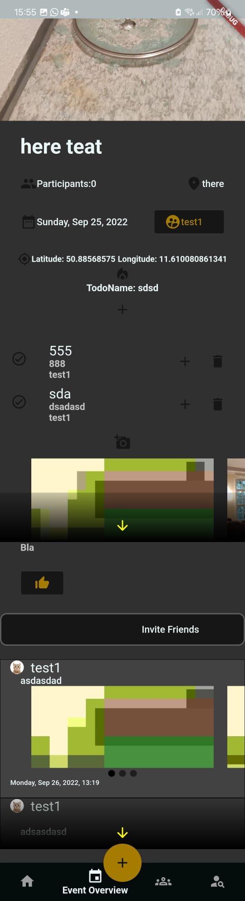
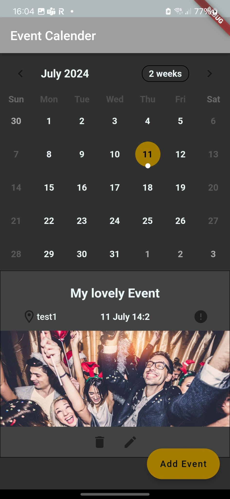
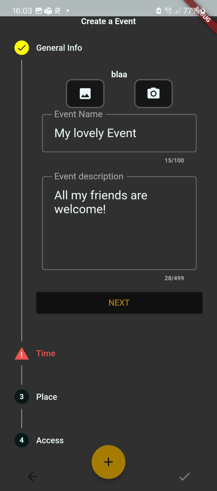
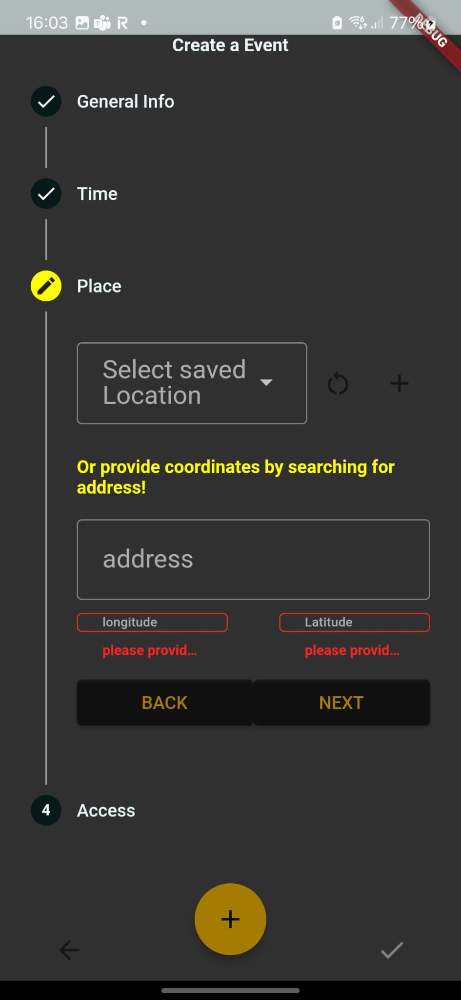
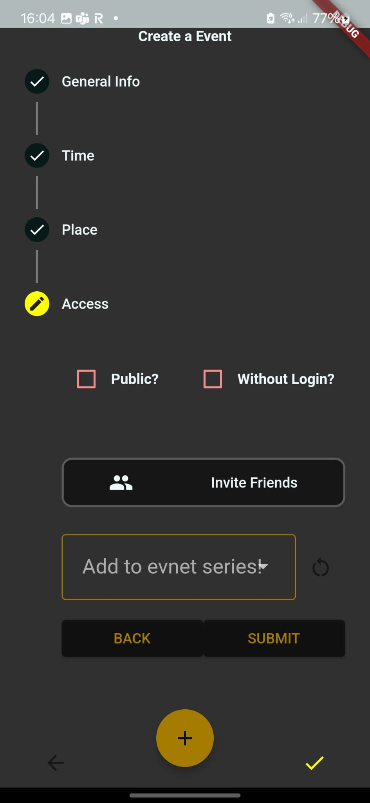

# Palk
This Project was dedicated to building a flutter based social network app. 
The purpose of the social network was to bring people togehter in real life.

## The Palk Paradigma
The idea of palk was to easily organize events. 
That included:
- Saving predefined locations
- generating todo and bring lists
- public and private events
- adding the event to a eventseries
- Verifying that people are actually there
  - if verified the person was allowed to post their pictures there
- allowing for posts with questions
- Seeing who is attending you event

Attending and finding events should be easy too:
- location based search
- managing event series
- gathering socializing points by attending events
- managing the users calendar

Also of course it has social features like friendships.

## Screenshots

Event Screen           |  Calendar Overview
:-------------------------:|:-------------------------:
|  

Of course it must be possible to add Events too:

Event Add          |  Event Location | Event Access
:-------------------------:|:-------------------------:|:-------------------------:
|   | 

## The End of Palk
The project ended, because of the lack of UX-Design and manpower to handle the upcoming workload. Also this repository had to many legacy code to take care of.
With some luck, this project will be rolled up again in the furture!
